# 앱 이름 : 10% D

## 목차
    1. 앱 간단 소개
    2. 앱의 기능
    3. UI
    4. 데이터 소스 및 API
    5. 참고자료

## 1. 앱 간단소계

### 1.1 앱 이름과 그 유래
    앱이름 : 10% D
    전통시장 상품권과 제로페이 등의 소상공인 지원 상품권을 구입 하여 사용 할 시 10% 할인을 받고   
    사용하는 것과 같은 효과를 받는 것에서 착안하여 10% 와 Discount 에서 D를 가져와    
    위 같은 이름을 가지게 되었습니다.

### 1.2 계기
    가족들과 외식을 나가서 계산할 때 어머니께서 제로페이로 결제해달라고 하는 것을 보며   
    처음 제로페이란 것을 알게되었습니다. 이에 대하여 흥미가 생겨서 조사를 해 보았습니다.   
    제로페이는 정부차원에서 소상공인들을 지원하기 위해 만들어진 정책인데,    
    대형마트나 이러한 곳에선 사용이 불가능한 대신 제로페이 상품권을 구입 할 때    
    10% 할인 된 가격으로 살 수 있게 한 것 입니다.    
    예를 들자면 10000원권을 구입하면 10%  할인된 가격인  9000원으로 산다는 것 입니다.    
    

    요즘 주변 상가들을 돌아다니며 자세히 관찰해 보면,  제로페이 결제가 가능 한곳이 많고,    
    차차 제로페이에 대한 관심이 높아져 제로페이 매수가 매진되는 현상도 보이고 있습니다.    
    이에 따라 제로페이에 관한 앱을 만들면 좋을 것 같다는 생각이 들어    
    앱 제작을 계획하게 되었습니다.    
    그리고 누비전이나 온누리상품권 같은 경우에도 제로페이와 비슷한 효과를 지니고 있고    
    관심또한 높아지고 있어 같이 기능을 제작하면 괜찮겠다 싶어서    
    전통시장 상품권과 제로페이에 대한 앱을 기획하게 되었습니다.

### 1.3 주 타겟층
    주 타겟층은 전통시장등을 자주다니는 중 장년층이나,    
    제로페이를 자주 활용하는 사람들을 주 타겟층으로 잡았습니다.

## 2 앱의 기능

### 2.1 가맹점 보기

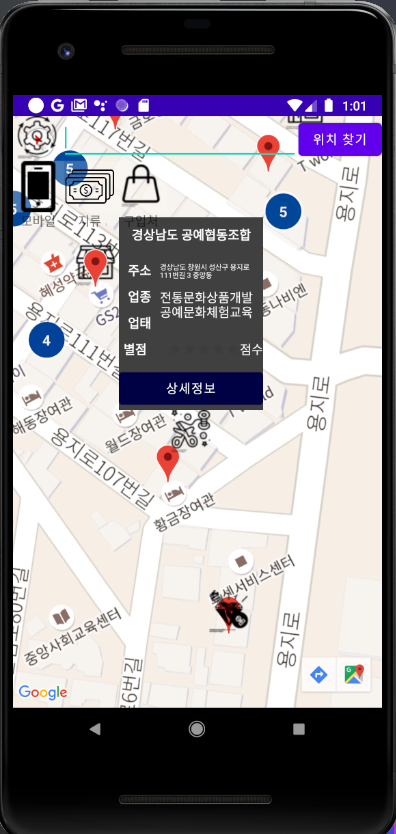

    가맹점의 위치를 구글 api를 이용하여 가맹점의 위치를 표시하겠습니다.   
    

### 2.2 판매처 보기

    상품권 판매점의 위치를 구글 api를 이용하여 판매점의 위치를 표시하였습니다.    
    또한 현재위치에서 목표 판매점까지의 길찾기 기능을 제공하였습니다.   
    그리고 상품권의 재고현황을 매일 갱신하여 정보를 제공하였습니다.

### 2.3 별점 및 리뷰 작성

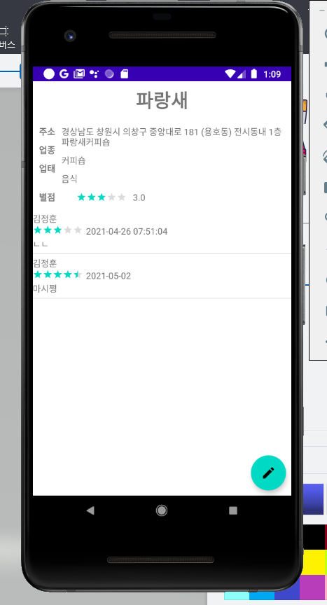

    지도에서 목표가맹점을 클릭하게되면 위와같이 별점과 리뷰정보를 제공하였습니다.

### 2.4 찾기

    이름으로 검색하여 원하는 가맹점을 찾을 수 있습니다. 

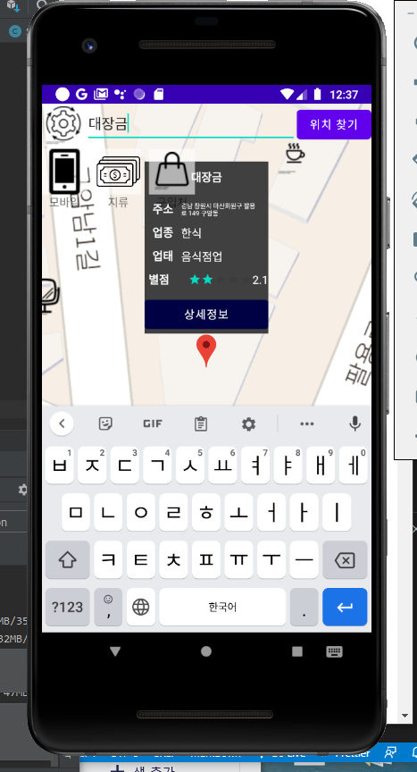

    찾아가려는 가맹점의 마커를 클릭한 이후, 우측 하단의 버튼을 눌러 길찾기 기능을 사용할 수 있습니다.
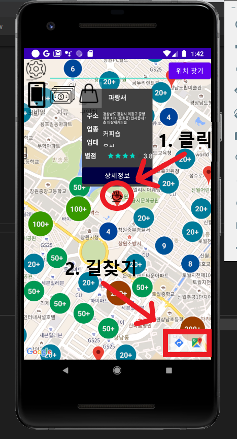
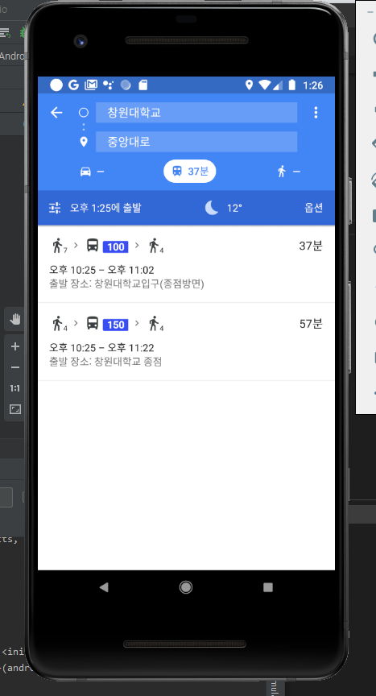

### 2.5 필터

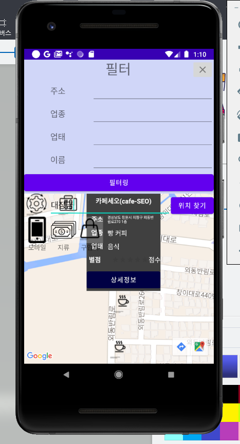
    
    화면상에 보이는 마커들을 원하는 방식대로 필터링하여 볼 수 있는 기능을 제공하고있습니다.

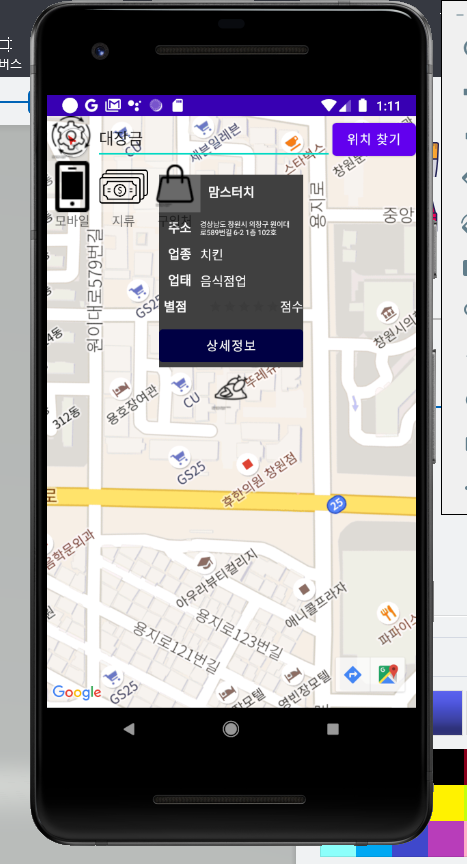

## 3. UI

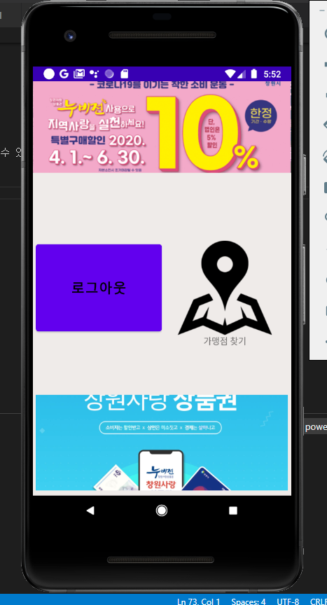
    UI는 메인 타겟층이 중장년층인 만큼 간단명료하게 제작할 것입니다.

## 4. 데이터 소스 및 API

### 4.1 제로페이 및 모바일 창원 사랑 상품권 가맹점 데이터

    창원시 빅데이터 포털 데이터 셋: 제로페이, 창원사랑상품권모바일 가맹점

<https://bigdata.changwon.go.kr/portal/dataset/datasetView.do?seq=144/>
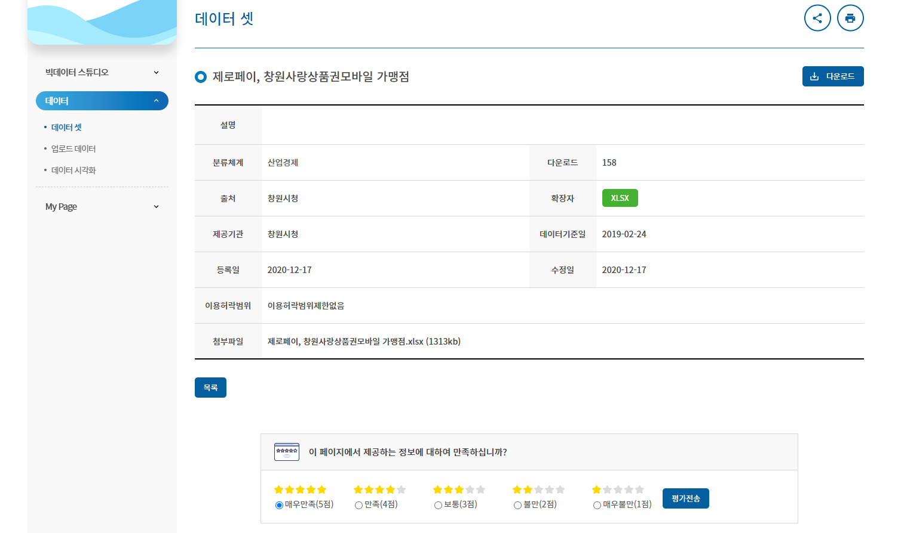

### 4.2 지류 상품권 가맹점 데이터

    창원시 빅데이터 포털 데이터 셋: 창원사랑상품권 지류 가맹점
    
<https://bigdata.changwon.go.kr/portal/dataset/datasetView.do?seq=145/>

### 4.3 도로명 주소 API

    도로명주소 API 사용
<https://www.juso.go.kr/addrlink/devAddrLinkRequestGuide.do?menu=roadApi/>
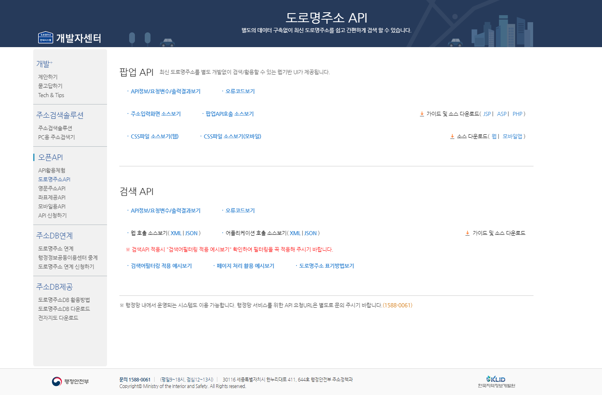

### 4.4 좌표제공 API

    좌표제공 API 사용
<https://www.juso.go.kr/addrlink/devAddrLinkRequestGuide.do?menu=coordApi/>
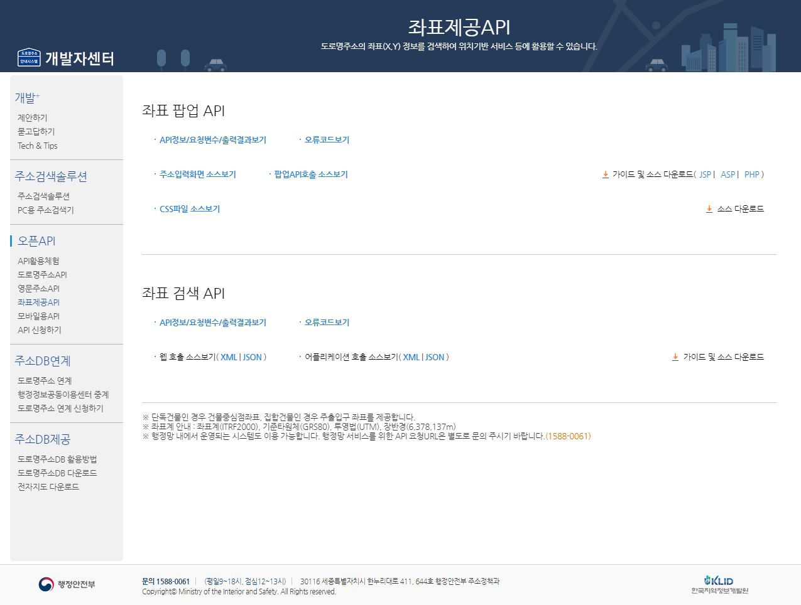

## 5. 데이터 전처리 과정

### 5.1 엑셀 파일 다운로드 및 csv 파일 전환

    MySQL에는 엑셀파일의 csv파일을 한번에 테이블로 넣을 수 있는 기능이 존재한다.(Table Data import Wizzard)
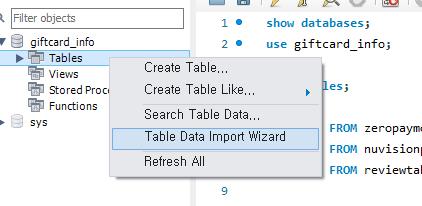
    따라서 기존의 .xlsx 파일을 .csv 또는 JSON 파일으로 변환할 필요가 있다.
    이때 주의할 점으로써 엑셀 파일내에 , 나 " 또는 ' 이 세문자가 있으면 사전에 다른 단어로 변환해 두어야 한다.
    왜냐하면 CSV 파일은 ,를 구분자로 인식한다. 따라서 변경하지 않을 시 예기치 않은 오류가 발생할 수 있다.
    또한 " ' 는 이후 JSON 파일로 변환시 단어 구분을 " ' 으로 하기때문에 오류가 발생할 수 있다.

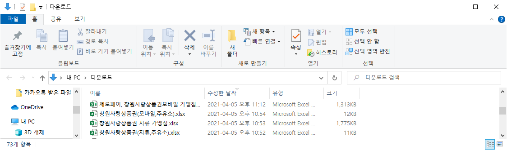
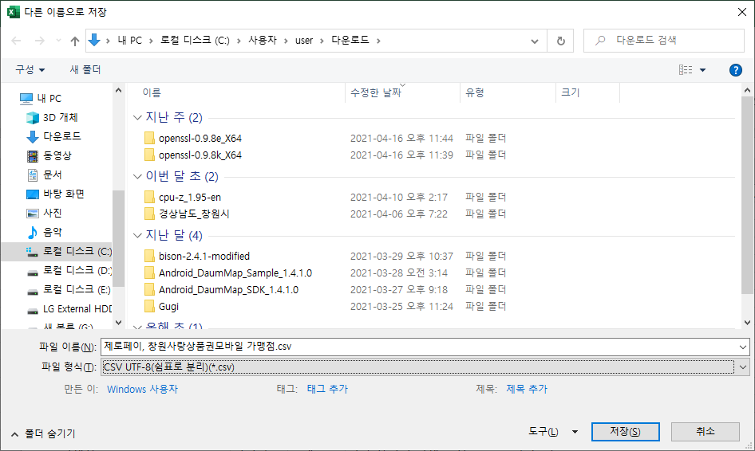

### 5.2 CSV >>> JSON 변환

    필자는 어떠한 이유에서인지 몰라도 csv파일을 테이블로 변환이 되지 않았다.
    구글링하여 찾아본 결과 JSON파일로는 될때가 있다하여 CSV 파일을 JSON 파일로 변환하였다.

    우선 메모장으로 csv 파일을 열어 텍스트를 복사한다.

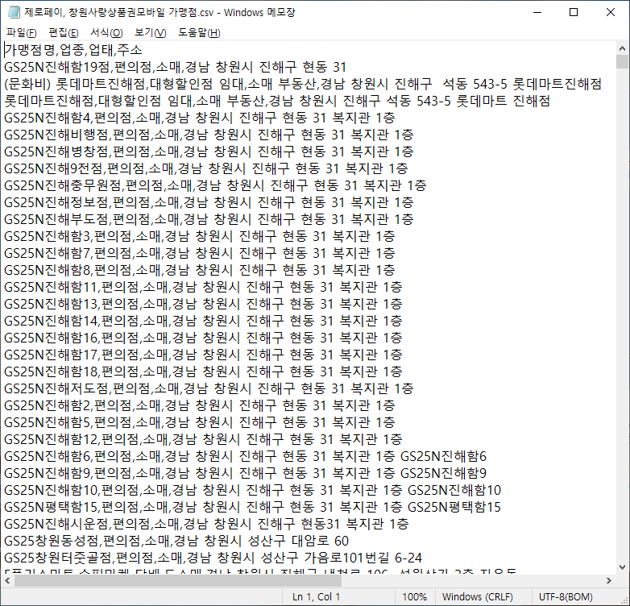

    다음,  Mr. Data Converter 사이트에 붙여넣기를 한다.
    그러면 다음과 같이 JSON형태로 변환이 되는데 이를 복사하여 JSON파일을 생성한다.

### 5.3 Mysql 데이터 입력

<https://shancarter.github.io/mr-data-converter/>
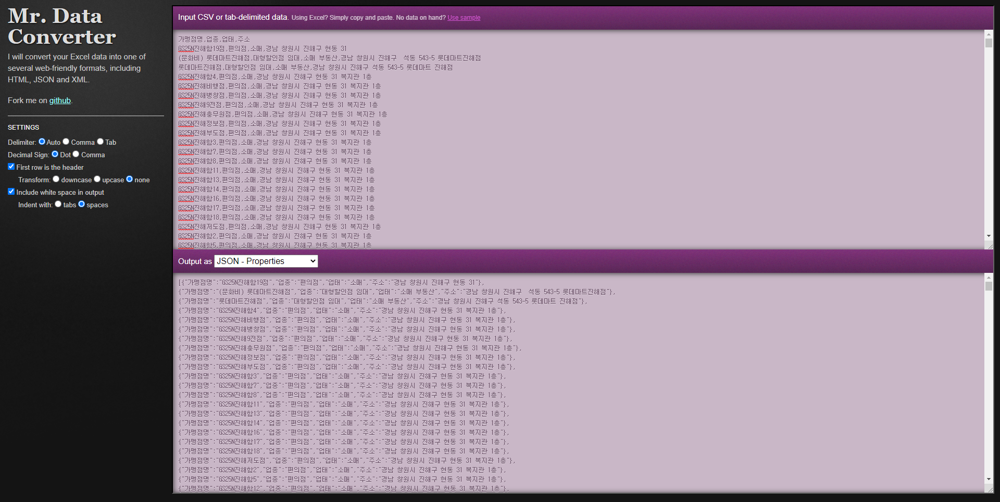
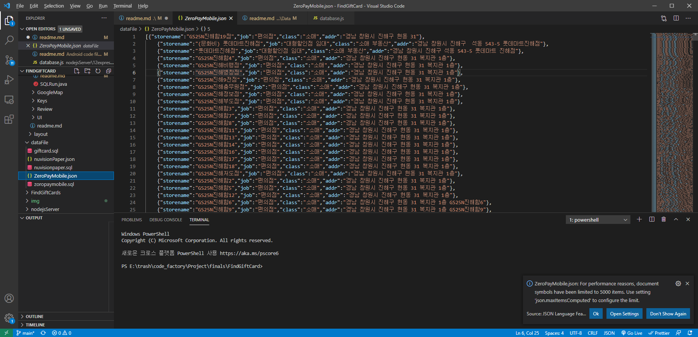

    이후 워크벤치의 Table Data import Wizzard를 써 JSON 파일을 Table 형태로 저장한다.

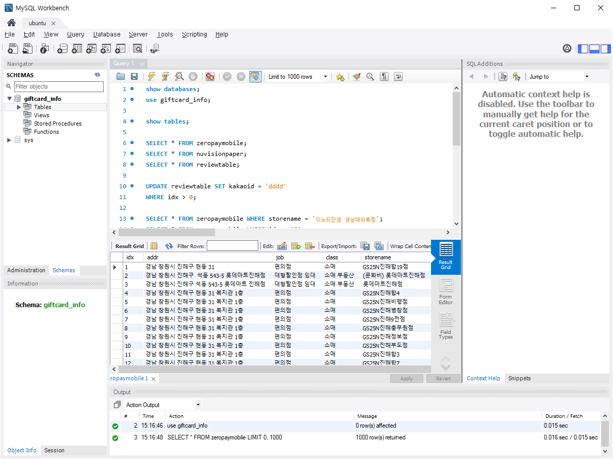

### 5.4 위도와 경도 값 구하기
    
    그런데 Google Map API 에서 원하는 지점에 마커를 찍으려면 도로명주소가 아닌 위도, 경도값이 필요하다.
    여기서 두가지 방법이 있는데 하나는 구글의 Place API를 활용하는 것 이고,
    다른 하나는 정부에서 제공하는 도로명주소 API를 활용하는 것 이다.
    필자는 후자의 방법을 택하였는데, 그 이유는 공짜이기 때문이다.
    Google Place API는 1000건당 17$의 과금이 발생함으로 쓰기에 적절하지 않다 생각하였다.

    이 과정은 코딩을 통하여 해결하였는데 sequance 다이어그램을 통해 간략히 보여주겠다.

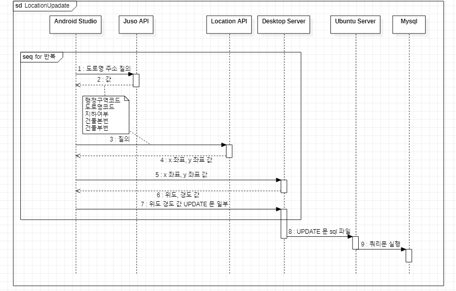

    위와 같이 처리한 이유는 다음과 같다.
    1. 데이터의 양이 모바일과 지류를 합하면 약 4만건 정도 되는데, 일일이 직접 처리하기엔 양이 너무 많다.
    2. 그리고 좌표제공 API에서 제공하는 좌표는 위도와 경도값이 아닌 이러한 좌표계를 쓰는데,
      '좌표계 안내 : 좌표계(ITRF2000), 기준타원체(GRS80), 투영법(UTM), 장반경(6,378,137m)' 
      이를 위도와 경도로 변환하려면 proj4j에서 제공하는 코드를 써야 한다. 
      그런데 이 코드를 사용하는 방법을 개인적 기술로썬 node js를 활용하는 방법밖엔 몰랐고,
      따라서 좌표값을 위도와 경도값으로 변환하려면 node js 서버를 한번 거쳐야 했다.
    3. MySQL 서버를 열어둔 AWS의 Light Sail의 Ubuntu가 한 row씩 처리하면 수만번의 통신을 해야하는데, 
      이를 버티지 못하고 성능이 저하되거나 죽는다.
    4. 그렇다고 한번에 쿼리문을 작성하여 보내면 REST로 전송하는 text의 양이 너무 많아 정상적으로 처리되지 않는다.
    5. 그리하여 수만건의 입출력을 견딜 수 있는 집의 Desktop 컴퓨터로 
      쿼리문을 sql 파일로 만든 다음 Ubuntu에 전송하여 쿼리문을 실행시켰다.

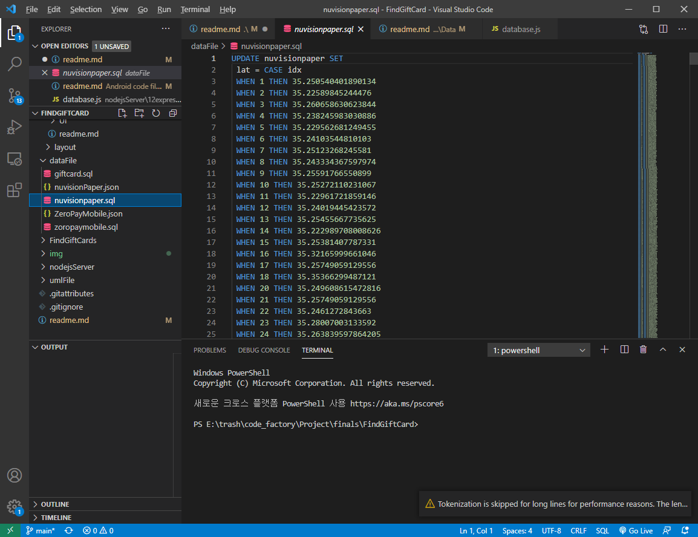

## 6. 서버 Node Js

    서버의 역할은 위에서도 설명하였다 싶이, 
    mysql과 android studio 를 이어주는 교두보 역할을 한다.
    작동 방식은 REST API 방식으로 마치 API를 사용하는 것 처럼,
    key 값을 입력하면 그에대한 값을 html로 보여주는 방식이다.
    view는 jade를 쓰고있다.
    Node Js 서버 구성은 다음과 같다.
    
        routes          view
    1.  index.js        index.jade
    2.  lat.js          lat.jade
    3.  lng.js          lng.jade
    4.  loc.js          loc.jade

    사용하고 있는 모듈은 다음과 같다.
    1. express
    2. path
    3. cookie-parser
    4. morgan
    5. http-errors
    6. mysql
    7. proj4
    8. phantom
    9. node-schedule

### 6.1 각각의 모듈들의 역할

#### 6.1.1 express

    express는 nodejs를 위한 웹 프레임 워크중 하나로 거의 사실상 node js의 표준서버 프레임이다.
    express-genarater를 통하여 간단하게 기본 설정된 파일을 받을 수 있다.

#### 6.1.2 path

    path 모듈은 서버컴퓨터에서 파일의 위치를 파악하거나,
    파일의 위치를 편집하는데 사용되는 모듈이다.
    express-genarater 을 사용하여 설치시 express 와 함께 같이 설치된다.

#### 6.1.3 cookie-parser

    서버에서 cookie를 쉽게 추출 및 작업할 수 있게 도와주는 모듈이다.
    express-genarater 을 사용하여 설치시 같이 설치된다.

#### 6.1.4 morgan

    서버의 콘솔창에 서버의 접속 로그, 서버 메시지 값등을 띄워준다.
    express-genarater 을 사용하여 설치시 같이 설치된다.

#### 6.1.5 http-errors

    서버의 에러를 다룰 때 편리하게 쓸 수 있는 모듈이다.
    express-genarater 을 사용하여 설치시 같이 설치된다.

#### 6.1.6 mysql

    서버에 설치된 mysql과 Node js 서버를 연결시켜주는 모듈이다.
    주의할 점은 mysql 8.0 버전과는 호환이 되지 않기에 mysql 버전을 확인해야 한다.

#### 6.1.7 proj4

    서로 다른 지도 투영법 간의 값의 변환을 돕는 모듈이다.
    여기선 GRS80 UTM 좌표를 위도와 경도값으로 변형하는데 사용하였다.

#### 6.1.8 phantom

    일반적으로 웹들은 html 문서로 구성되고 파싱시 이 데이터를 가져올 수 있다.
    그러나 java script 등으로 내부 태그 등을 추가하는 경우에는 
    파싱 시 원하는 데이터를 얻어올 수 없는 경우가 있다.
    창원사랑 상품권 지류 판매처 데이터를 제공하는 사이트가 이에 속한다.
    그러나 phantom js 는 실제로 웹브라우저 등을 통하여 접속하여 
    페이지를 요청하는 듯한 기능을 제공한다.
    따라서 phantom 모듈을 사용하게 되었다.

#### 6.1.9 node-schedule

    노드 스케듈 모듈은 리눅스에서 시간을 표시하는 방법으로 시간을 지정하여
    일정한 때마다 원하는 작업을 실행시킬 수 있다.
    이를 통하여 매일 phantom을 통한 크롤링 작업을 자동으로 수행하고 있다.
    

### 6.2 각각의 view 와 routes

#### 6.2.1 app.js

    app.js는 서버를 구성하는 메인 js 파일이다.
    app.js는 각각의 페이지에 routes를 연결하는 역할 및 에러제어기능으로 구성된다.
    또한 node-schedule과 phantom 모듈을 통하여
    하루 한번 지류 판매처의 정보를 크롤링해 온다.

#### 6.2.2 index

    index 의 역활은 SQL 문을 key값으로 받아서 그에대한 결과값을 pre 태그에 보여준다.
    예를 들자면 SELECT * FROM user_info; 라는 key 값을 보네면,
    이에 대한 결과값을 웹페이지에 보낸다.

#### 6.2.3 lat, lng, loc

    loc 는 x좌표값과, y좌표값을 받아서 proj4모듈을 통하여 위도값과 경도값을 출력한다.
    데이터 전처리부분에서도 설명하였지만, 여기서 받은 위도값과 경도값을 각각 lat과 lng으로 키값으로 보낸다.
    그러면 각각 UPDATE문을 구성하는 일부 문장으로 변형되어 출력된다.
 

## 참고자료

