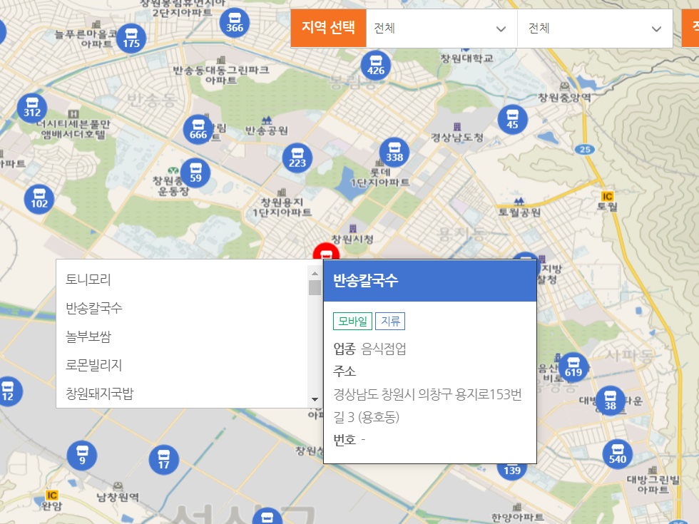
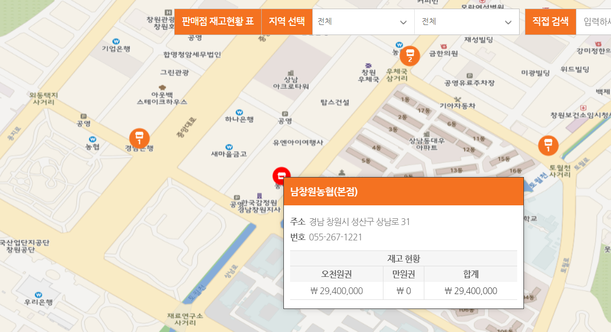
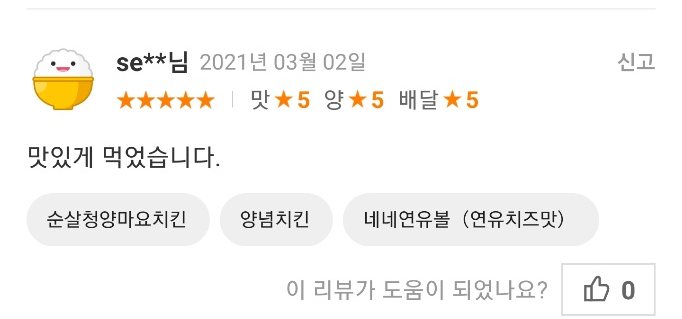

# 앱 이름 : 10% D

## 목차
    1. 앱 간단 소개
    2. 앱의 기능
    3. UI 계획
    4. 참고자료

## 1. 앱 간단소계

### 1.1 앱 이름과 그 유래
    앱이름 : 10% D
    전통시장 상품권과 제로페이 등의 소상공인 지원 상품권을 구입 하여 사용 할 시 10% 할인을 받고   
    사용하는 것과 같은 효과를 받는 것에서 착안하여 10% 와 Discount 에서 D를 가져와    
    위 같은 이름을 가지게 되었습니다.

### 1.2 계기
    가족들과 외식을 나가서 계산할 때 어머니께서 제로페이로 결제해달라고 하는 것을 보며   
    처음 제로페이란 것을 알게되었습니다. 이에 대하여 흥미가 생겨서 조사를 해 보았습니다.   
    제로페이는 정부차원에서 소상공인들을 지원하기 위해 만들어진 정책인데,    
    대형마트나 이러한 곳에선 사용이 불가능한 대신 제로페이 상품권을 구입 할 때    
    10% 할인 된 가격으로 살 수 있게 한 것 입니다.    
    예를 들자면 10000원권을 구입하면 10%  할인된 가격인  9000원으로 산다는 것 입니다.    
    

    요즘 주변 상가들을 돌아다니며 자세히 관찰해 보면,  제로페이 결제가 가능 한곳이 많고,    
    차차 제로페이에 대한 관심이 높아져 제로페이 매수가 매진되는 현상도 보이고 있습니다.    
    이에 따라 제로페이에 관한 앱을 만들면 좋을 것 같다는 생각이 들어    
    앱 제작을 계획하게 되었습니다.    
    그리고 누비전이나 온누리상품권 같은 경우에도 제로페이와 비슷한 효과를 지니고 있고    
    관심또한 높아지고 있어 같이 기능을 제작하면 괜찮겠다 싶어서    
    전통시장 상품권과 제로페이에 대한 앱을 기획하게 되었습니다.

### 1.3 주 타겟층
    주 타겟층은 전통시장등을 자주다니는 중 장년층이나,    
    제로페이를 자주 활용하는 사람들을 주 타겟층으로 잡았습니다.

## 2 앱의 기능

### 2.1 가맹점 찾기

### 2.2 판매처 찾기

### 2.3 별점 및 리뷰 작성

